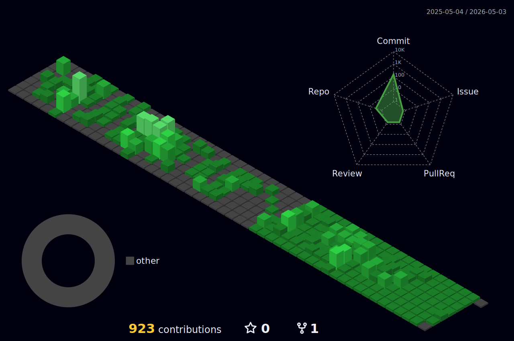

  
   
       
     

      👋🏻 Hi there! i'm front-end developer. 
      I am using React and currently developing a flutter app. 
      I'm very interested in cross-platform and I like web development.
     

### 💪 Skills
#### Platforms & Languages
 

   

 

